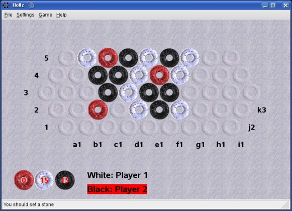
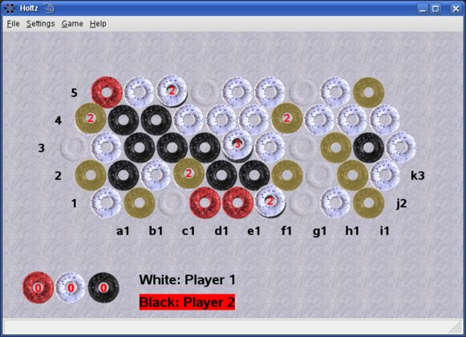
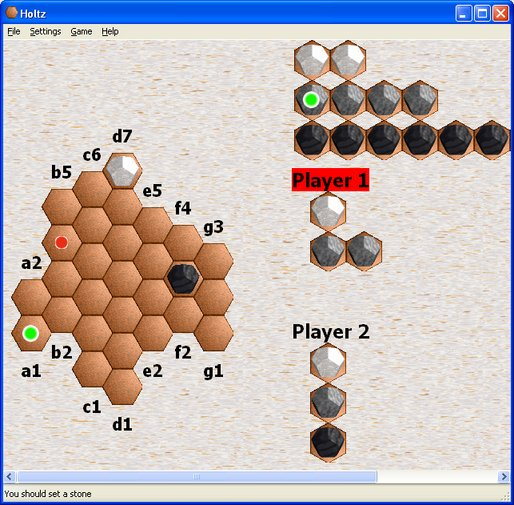
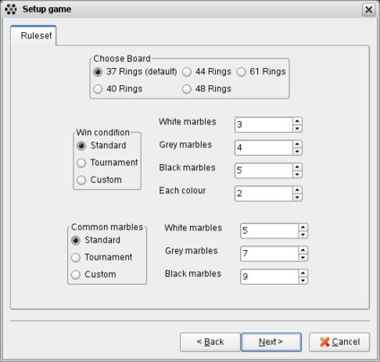
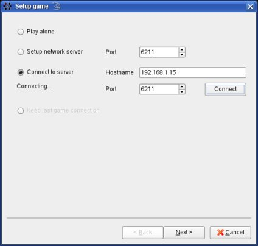
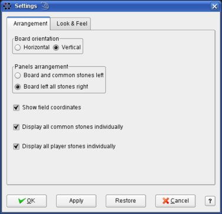
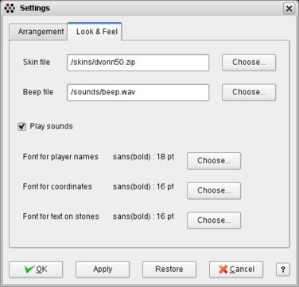

# Holtz - an implementation of the abstract strategy games Zertz, Dvonn, Blokus, and Take it Easy

Holtz was initially developed on sourceforge. You can view the project page here: https://holtz.sourceforge.io/

## Motivation

I implemented Holtz because I loved the games at end of High School and had no suitable opponent close by.
Thus Holtz was used on the one hand to support my online games on pbmserv and LittleGolem. On the other hand, 
it was fun implementing an AI for each game and a client-server mode where you can use holtz to play online without 
any online plattform needed.

## Code disclaimer

The code was written at young age in C++ as a fun project. It was gradually enhanced and from game one to game two I 
made the decision to use a hacky way of templating that needed the smallest code changes. 

## Install

I guess the easiest way (at least for Windows users) is to download an executable from [here](https://holtz.sourceforge.io/down.php). 
Changes became rare since a decade, but I somehow got installing wxwidgets, and automake to work every time I got a new PC.
So, for Linux, I am confident that installing wxwidgets, g++ and automake and running `make` should work fine.
The RPM build spec works fine for recent OpenSuSE versions as well: https://build.opensuse.org/package/show/home:trautm/holtz-1.5.0

I even get cross-compilation to work to build Windows executables within Linux whenever I try hard enough...

Feel free to reach out to me whenever you experience problems or file an issue.

## Screenshots

Zèrtz screen:

Dvonn screen:

Stacking phase with help mode "show possible moves" activated:

  
The graphics of Holtz can be modified using skin files. The green and red dots 
mark a hint move given by the AI.

The Zèrtz game is highly configurable:

Play Zèrtz or Dvonn over the network:

For Zèrtz the layout of board and marbles is configurable:

Zèrtz and Dvonn offer the choice of skins, move reminder sounds, and fonts:

